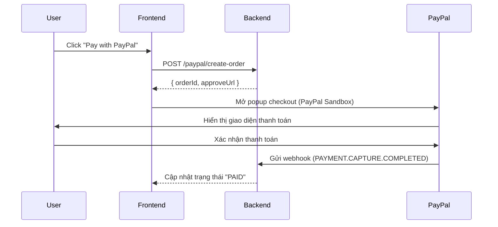

# 💳 PayPal Checkout UI Flow (Frontend Integration)

## 🧭 Mục tiêu
Tài liệu này mô tả luồng **frontend UI** để tích hợp thanh toán bằng PayPal — bao gồm tạo order, hiển thị nút thanh toán, xử lý callback, và xác nhận trạng thái thanh toán.

---

## 🧩 1️⃣ Cấu trúc tổng thể



---

## ⚙️ 2️⃣ Cài đặt SDK PayPal

### Cài thư viện SDK
```bash
npm install @paypal/react-paypal-js
# hoặc
yarn add @paypal/react-paypal-js
```

### Cấu hình global provider (App.tsx hoặc _app.tsx)
```tsx
import { PayPalScriptProvider } from "@paypal/react-paypal-js";

export default function App({ Component, pageProps }) {
  return (
    <PayPalScriptProvider
      options={{
        "client-id": process.env.NEXT_PUBLIC_PAYPAL_CLIENT_ID!,
        currency: "USD",
        intent: "capture",
      }}
    >
      <Component {...pageProps} />
    </PayPalScriptProvider>
  );
}
```

---

## 💳 3️⃣ Component PayPalCheckoutButton

**📄 `components/PayPalCheckoutButton.tsx`**

```tsx
"use client";

import { PayPalButtons } from "@paypal/react-paypal-js";
import axios from "axios";
import { useState } from "react";

export default function PayPalCheckoutButton({ amount }: { amount: string }) {
  const [loading, setLoading] = useState(false);

  return (
    <div>
      <PayPalButtons
        style={{ layout: "vertical" }}
        createOrder={async () => {
          setLoading(true);
          try {
            const res = await axios.post("/api/paypal/create-order", {
              value: amount,
              currency: "USD",
            });
            setLoading(false);
            return res.data.orderId;
          } catch (err) {
            setLoading(false);
            alert("Error creating PayPal order");
            throw err;
          }
        }}
        onApprove={(data) => {
          alert("✅ Payment approved!");
          console.log("PayPal Order:", data);
        }}
        onError={(err) => {
          console.error("❌ PayPal Checkout Error:", err);
          alert("Payment failed");
        }}
      />
    </div>
  );
}
```

---

## ⚙️ 4️⃣ Proxy API (frontend → backend)

**📄 `/pages/api/paypal/create-order.ts`**

```ts
import axios from "axios";

export default async function handler(req, res) {
  try {
    const backend = process.env.NEXT_PUBLIC_API_URL; // ví dụ: http://localhost:3000
    const response = await axios.post(`${backend}/paypal/create-order`, req.body);
    res.status(200).json(response.data);
  } catch (err) {
    console.error(err.response?.data || err.message);
    res.status(500).json({ error: "Failed to create PayPal order" });
  }
}
```

---

## 🎨 5️⃣ Trang Checkout UI

**📄 `pages/checkout.tsx`**
```tsx
import PayPalCheckoutButton from "@/components/PayPalCheckoutButton";

export default function CheckoutPage() {
  return (
    <div className="checkout-container">
      <h2>Checkout</h2>
      <p>Total: <strong>$29.99</strong></p>
      <PayPalCheckoutButton amount="29.99" />
    </div>
  );
}
```

---

## 🧠 6️⃣ Kiểm tra trạng thái thanh toán sau webhook

Webhook ở backend là nơi xác nhận thật sự (`CAPTURE.COMPLETED`).  
Frontend có thể gọi API kiểm tra trạng thái đơn hàng sau vài giây:

```ts
const checkPaymentStatus = async (orderId: string) => {
  const res = await axios.get(`/orders/${orderId}/status`);
  if (res.data.status === "PAID") alert("✅ Payment verified!");
};
```

---

## 🌐 7️⃣ Deploy production

| Thành phần | Cấu hình cần thay đổi |
|-------------|----------------------|
| PayPal Client ID | Dùng client live (không sandbox) |
| Webhook URL | Đặt đúng domain thật (https://yourdomain.com/paypal/webhook) |
| API Backend | Phải trả HTTPS và verify signature |
| PayPal SDK | Tự động dùng endpoint live khi Client ID live |

---

## ✅ 8️⃣ Tổng kết flow UI

| Bước | Hành động | Mô tả |
|------|------------|-------|
| 1 | User click “Pay with PayPal” | Gọi backend tạo order |
| 2 | Backend trả về `orderId` | SDK PayPal mở popup |
| 3 | User thanh toán thành công | PayPal gửi webhook |
| 4 | Backend verify & cập nhật DB | Order chuyển sang `PAID` |
| 5 | UI hiển thị trạng thái hoàn tất | Gọi API `/orders/:id/status` |

---

**Author:** Dev Team — *Ecom_Project / PayPal Integration*
